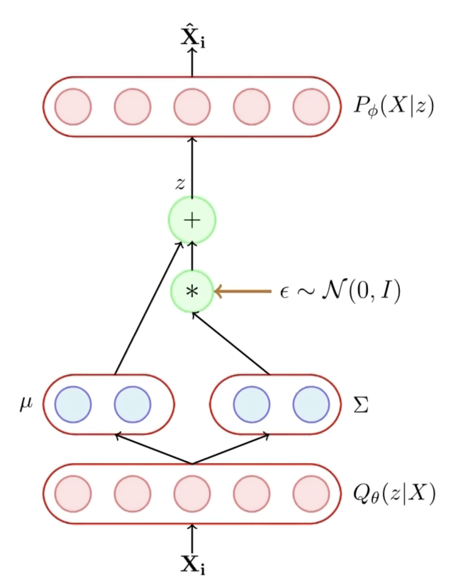

<h1 align = "center"> DCGAN MNIST </h1>

<p align="center">

</p>

<h1 align = "center"> DCGAN CelebA </h1>

<p align="center">

</p>

<h1 align = "center"> Interpolation in the Latent Space </h1>

```math
\begin{equation}
\textbf{w}^* = \lambda \textbf{a} + (1 - \lambda) \textbf{b}
\end{equation}
```

<p align="center">

</p>

<p align="center">

</p>

<h1 align = "center"> Kullback-Leibler Divergence </h1>

### KL Divergence of Two Distributions of Continuous Random Variable

$$ D\_{KL}(p \parallel q) = \underset{x \sim p(x)}{\int} p(x) \log \frac{p(x)}{q(x)} $$

### KL Divergence of Two Gaussians

For a $k$-dimensional Gaussian, the PDF $p(\mathbf{x})$ is given as:

$$ p(\mathbf{x}) = \frac{1}{(2 \pi)^{k/2} | \Sigma |^{1/2}} \exp \left(-\frac{1}{2} (\mathbf{x} - \boldsymbol{\mu})^T \Sigma^{-1} (\mathbf{x} - \boldsymbol{\mu}) \right) $$

Let $p$ and $q$ be two Normal Distributions denoted as $\mathcal{N}(\boldsymbol{\mu}_p, \Sigma_p)$ and $\mathcal{N}(\boldsymbol{\mu}_q, \Sigma_q)$ respectively.

Then the KL Divergence between these two:

$$ D\_{KL}(p \parallel q) = \mathbb{E}\_p[ \log(p) - \log(q)] $$

$$ D\_{KL}(p \parallel q) = \frac{1}{2} [ \log \frac{| \Sigma_q |}{| \Sigma_p |} - k + (\boldsymbol{\mu_p} - \boldsymbol{\mu_q})^T \Sigma_q^{-1} (\boldsymbol{\mu_p} - \boldsymbol{\mu_q}) + tr \{ \Sigma_q^{-1} \Sigma_p \}] $$

In the scenario when $q$ is $\mathcal{N}(0, I)$, we get

$$ D\_{KL}(p \parallel q) = \frac{1}{2} [ \boldsymbol{\mu_p}^T \boldsymbol{\mu_p} + tr \{ \Sigma_p \} - k - \log |\Sigma_p| ] $$

<h1 align = "center"> Generative Adversarial Network </h1>

```math
\begin{equation}
\min_{\phi} \max_{\theta} V(G, D) = \underset{\textbf{x} \sim p{\text{data}}}{\mathbb{E}} [\log(D_{\theta}(\textbf{x}))] + \underset{\textbf{z} \sim p_z(\textbf{z})}{\mathbb{E}} [1 - \log(D_{\theta}(G_{\phi}(\textbf{z})))]
\end{equation}
```

<h1 align = "center">Variational AutoEncoders</h1>

We wish to achieve two goals:

1. **Learning Abstraction** $\to$ A hidden representation given the input $P(z | X)$ - this is achived by the **Encoder** $Q_{\theta}(z | X)$.
2. **Generation** $\to$ given some hidden representation using the **Decoder** $P_{\phi}(X | z)$.

For all these our aim to understand the joint distribution $P(X, z) = P(z) \cdot P(X | z)$. At inference we want given some $X$ (observed variable), finding out the most likely assignments of **latent variables** $z$ which would result in this observation.

$$ P(z | X) = \frac{P(X | z) \cdot P(z)}{P(X)} $$

But since $P(X) = \int P(X | z) \cdot P(z) dz = \int \int \dots \int P(X | z_1, z_2, \dots z_n) \cdot P(z_1, z_2, \dots z_n) dz_1 \cdot dz_2 \dots dz_n$ is **intractable**.

<p align="center">

</p>

Hence instead, we assume the posterior distribution $P(z | X)$ as $Q_{\theta}(z | X)$. Further assume that $Q_{\theta}(z | X)$ is a **Gaussian** whose parameters are determined by our neural network $\to$ **Encoder**.

$$ \boldsymbol{\mu}, \Sigma = g\_{\theta}(X) $$

Since

$$ D*{KL} (Q*{\theta}(z | X) \parallel P(z | X) ) = \int Q*{\theta}(z | X) \log \frac{Q*{\theta}(z | X)}{P(z | X)} \cdot dz $$

```math
\begin{equation}
= \underset{z \sim Q_{\theta}(z | X)}{\mathbb{E}} \left[ \log(Q_{\theta}(z | X)) - \log(P(z | X)) \right]
\end{equation}
```

```math
\begin{equation}
= \mathbb{E}_Q \left[ \log(Q_{\theta}(z | X)) - \log \left( \frac{P(X | z) \cdot P(z)}{P(X)} \right) \right]
\end{equation}
```

```math
\begin{equation}
= \mathbb{E}_Q \left[ \log(Q_{\theta}(z | X)) - \log(P(z)) \right] - \mathbb{E}_Q \left[ \log (P(X | z)) \right] + \log(P(X))
\end{equation}
```

Also since

```math
\begin{equation}
\mathbb{E}_Q [ \log(Q_{\theta}(z | X)) - \log(P(z)) ] = D_{KL} (Q_{\theta}(z | X) \parallel P(z) )
\end{equation}
```

so, the finally rearranging we may write

```math
\begin{equation}
\log(P(X)) = \color{red}{D_{KL} \left(Q_{\theta}(z | X) \parallel P(z | X) \right)} + \color{blue}{\mathbb{E}_Q \left[ \log (P(X | z)) \right] - D_{KL} \left(Q_{\theta}(z | X) \parallel P(z) \right)}
\end{equation}
```

since

```math
\begin{equation}
\color{red}{D_{KL} \left(Q_{\theta}(z | X) \parallel P(z | X) \right) \ge 0}
\end{equation}
```

```math
\begin{equation}
\color{blue}{\mathbb{E}_Q \left[ \log (P(X | z)) \right] - D_{KL} \left(Q_{\theta}(z | X) \parallel P(z) \right)} \le \log(P(X))
\end{equation}
```

And since the final task is maximising the log-likelihood of $P(X)$, hence it is equivalent to maximizing the $\color{blue}{\text{Blue Term}}$. So, the final objective is

```math
\begin{equation}
\color{green}{\mathcal{L}(\theta, \phi) = \max_{\theta, \phi} \left\{ \mathbb{E}_Q \left[ \log (P_{\phi}(X | z)) \right] - D_{KL} \left(Q_{\theta}(z | X) \parallel P(z) \right) \right \}}
\end{equation}
```

Now clearly all the terms are within our reach. To get the KL divergence, we make a forward pass through the **Encoder** to get $Q_{\theta}(z | X)$ and we know $P(z)$

$$ Q\_{\theta}(z | X) \sim \mathcal{N}(\boldsymbol{\mu_z}(X), \Sigma_z(X)) $$

$$ P(z) \sim \mathcal{N}(\mathbf{0}, I) $$

Now, in order for back propogation algorithm to work, we introduce the continuity in the sampling of $z$ by moving the sampling process to an input layer this is done first by sampling from a Standard Gaussian $\epsilon \sim \mathcal{N}(0, I)$ and then obtaing $z$ with the required $\boldsymbol{\mu_z}(X), \Sigma_z(X)$

$$ z = \boldsymbol{\mu_z}(X) + \Sigma_z(X) \times \epsilon $$

Hence, the randomness has been shifted to $\epsilon$ and not the $X$ or the parameters of the model.

<p align="center">

</p>

### Generation Part

After the model parameters are learned we **remove** the **encoder** and feed a $z \sim \mathcal{N}(0, I)$ to the decoder. The decoder will then predict $f_{\phi}(z)$ and we can draw an $X \sim \mathcal{N}(f_{\phi}(z), I)$.
